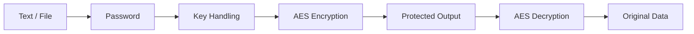

<div align="center">


[](https://www.python.org/)
[](https://en.wikipedia.org/wiki/Advanced_Encryption_Standard)
[](https://docs.python.org/3/library/tkinter.html)

### 🔐 A Desktop Cryptography Learning Project

**A Python GUI for experimenting with AES-based text and file encryption workflows.**

</div>

---

## 🧠 Overview

AES Encryption Project is a desktop application built with Python and Tkinter to demonstrate symmetric encryption, password-based key handling, file processing and a security-focused GUI.

> **Educational project:** useful for learning cryptography concepts; not a replacement for audited encryption software or a production key-management system.

## ✨ Features

- 🔒 AES-based text encryption/decryption
- 📂 File encryption workflow
- 🔑 Password-based key handling
- 📈 File-processing progress display
- 🖥️ Tkinter desktop interface
- ✅ Input validation and error handling
- 📋 Copy encrypted/decrypted output

## ⚡ Workflow



## 🛠️ Technology Stack

`Python` `Tkinter` `PyCryptodome` `AES` `File Handling`

## 📁 Project Structure

```text
AES-Encryption-Project/
├── aes_project.py
├── .gitignore
├── assets/
│   └── README-banner.svg
└── README.md
```

## 🚀 Quick Start

```bash
git clone https://github.com/wwwsahilchand123-maker/AES-Encryption-Project.git
cd AES-Encryption-Project
pip install pycryptodome
python aes_project.py
```

## 🔐 Security Roadmap

- [ ] Use Argon2id, scrypt or PBKDF2 with a random salt for password-derived keys
- [ ] Prefer authenticated encryption such as AES-GCM
- [ ] Detect ciphertext tampering with authentication tags
- [ ] Define a versioned encrypted-file format
- [ ] Add automated round-trip and wrong-password tests
- [ ] Add large-file and failure-recovery tests

## 🧪 Test Principle

```text
original data
    ↓ encrypt
ciphertext
    ↓ decrypt with same key
original data
```

Wrong passwords and modified ciphertext should fail safely.

## ⚠️ Security Note

Do not use this project to protect high-value real-world secrets until its cryptographic design and implementation have been independently reviewed and hardened.

---

<div align="center">

### 🔐 UNDERSTAND THE PRIMITIVE · RESPECT THE THREAT MODEL

**Built by Sahil Chand**

</div>
